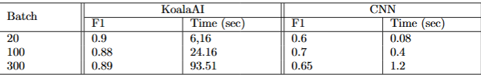

# ContentSense - Webpage content checker for Chrome
A lightweight Google Chrome extension to detect and prevent users from unintentionally interacting with harmful/inappropriate content. It achieves this by checking for text content in a page using a neural network and injecting a blocker page into the webpage to ensure that the users are aware of the page they are accessing.

## Setting Up
1. To obtain the repository, run ```git clone https://github.com/chengq220/ContentSense.git```
### Setup Extension in Chrome 
1. Open Google Chrome and enter the search bar ```chrome://extensions```
2. Enable Developer Mode by clicking the toggle switch next to Developer Mode in the top right corner
3. Click on ```Load Unpacked``` and select the extension folder in the repository
4. Check your extensions 

### Setup backend web services
1. Run ```docker-compose up --build``` to build the docker image
2. The default access point is http://localhost:8000/
3. Check ```http://localhost:8000/docs#``` for all the available commands

### Training Neural Network
1. The training procedure is stored in ```/training```
2. Change ```/training/config.py``` to the desired values and run ```python training.py```
The performance of the KoalaAI Content Moderation Model vs Distilled CNN is shown below


## Screenshots

